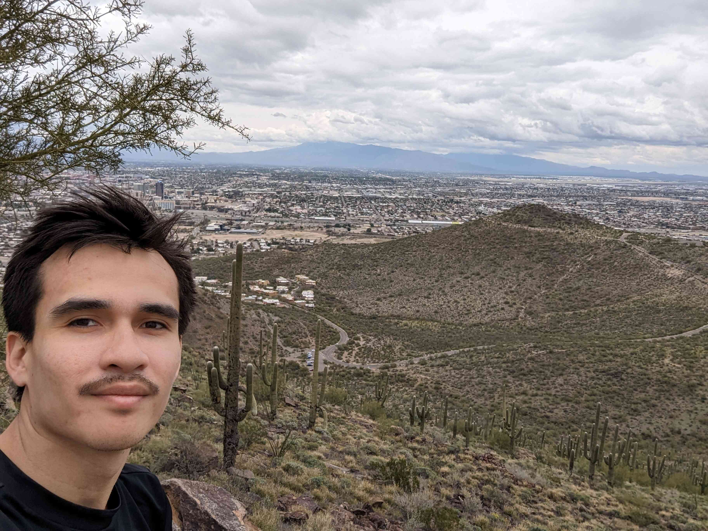

# Alan García-López

<!-- [Photo](photo-desert.jpg) -->

## Education

3. [Department of Earth and Enviromental Science (DEES), Columbia University (New York)](https://eesc.columbia.edu/)
   
   _PhD in Earth and Enviromental Sciences_
   
   [Personal@DEES](https://eesc.columbia.edu/content/alan-andres-garcia-lopez)
   
2. [University of Innsbruck (Austria)](https://www.uibk.ac.at/en/) & [University of Padua (Italy)](https://www.unipd.it/en/)
    
    _Master of Science in Astrophysics_
    
1. [Universidad de San Carlos de Guatemala](https://www.usac.edu.gt)

    _Bachelor in Applied Physics_
    

## Research Interests

* Climate forecast and verification
* Seasonal and sub-seasonal (s2s) forecasts
* Climate services 
* Rainfall Characteristics
* Regional climate: Central America and the Caribbean, tropical regions.
* Climate forecasts for agriculture

## Publications

3.  Kowal, K. Slater, Louise J. __García-López, Alan.__ Van Loon, Anne F.  _A comparison of seasonal rainfall forecasts over Central America using dynamic and hybrid approaches from Copernicus Climate Change Service seasonal forecasting system and the North American Multimodel Ensemble._ International Journal of Climatology, Volume 43, Issue 5, 2022. ΅[https://doi.org/10.1002/joc.7969](https://doi.org/10.1002/joc.7969)

2. García-Pérez, J. __García-López, Alan.__ Carillo-Ovalle, L. Solares-Cortez, N, López-Bran. _Harmful algal bloom ofPyrodinium bahamensein December 2018 in the Pacific coast of Guatemala._ Ciencia, Tecnología y Salud, Volume 7, Issue 1, 2020. [https://doi.org/10.36829/63CTS.v7i1.810](https://doi.org/10.36829/63CTS.v7i1.810)

1. Negrete, C.A. Dultzin, D. Marziani, P. Esparza, D. Sulentic, J.W. Del Olmo, A. Martínez-Aldama, M.L. __García-López, Alan.__ D'Onofrio, M. Bon, N. Bon. E. Astronomy and Astrophysics, 620, A118, 2018. [https://doi.org/10.1051/0004-6361/201833285](https://doi.org/10.1051/0004-6361/201833285)

_In preparation_

A. Jupin, JLJ. __García-López, Alan.__ Briceño-Zuluaga, F. Sifeddine, A. Ruiz-Fernandez, A.C. _Spatiotemporal precipitation variability and trends in the Usumacinta basin (Mexico-Guatemala)._ International Journal of Climatology.   

###
### *Nubes* 
> *No habrá una sola cosa que no sea  
> una nube. Lo son las catedrales 
> de vasta piedra y biblícos cristales 
> que el tiempo allanará. Lo es la Odisea, 
> que cambia como el mar. Algo hay distinto  
> cada vez que la abrimos. El reflejo 
> de tu cara ya es otro en el espejo 
> y el día es un dudoso laberinto.  
> Somos los que se van. La numerosa 
nube que se deshace en el poniente 
>es nuestra imagen. Incesantemente  
>la rosa se convierte en otra rosa. 
>Eres nube, eres mar, eres olvido. 
>Eres también aquello que has perdido. *
>
> <cite> Jorge Luis Borges (1985) </cite>
